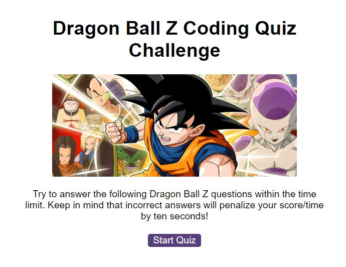
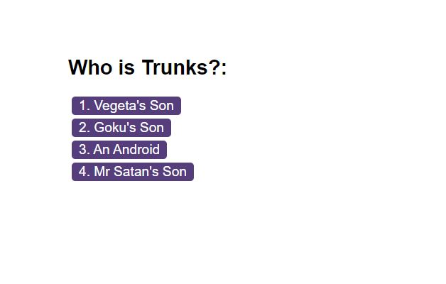
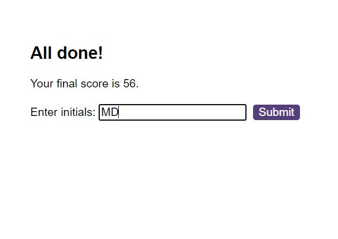
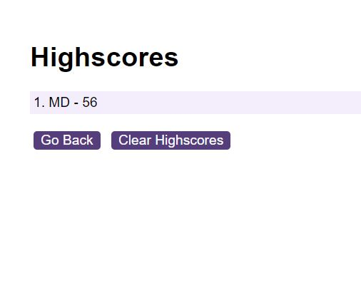

# Web APIs: Code Quiz

## Description

My motivation for building this project was to replicate a task which is sometimes given to interviewees as part of and a coding assessment. Thus testing my skills within JavaScrpt as if I am the interviewee.

This mini project is a timed coding quiz with multiple-choice questions. The app run's in the browser, and feature's dynamically updated HTML and CSS powered by JavaScript.

The coded quiz contains the following criteria::

* A start button that when clicked a timer starts and the first question appears.
 
  * Questions contain buttons for each answer.
  * When answer is clicked, the next question appears
  * If the answer clicked was incorrect then subtract time from the clock

* The quiz should end when all questions are answered or the timer reaches 0.

  * When the game ends, it should display their score and give the user the ability to save their initials and their score
  
## Screenshots

The following animation demonstrates the application functionality:

## Links

https://marlenadowner.github.io/Multiple-Choice-JS-Quiz/

https://github.com/MarlenaDowner/Multiple-Choice-JS-Quiz

## License

MIT License

Copyright (c) 2022 MIT License.

Permission is hereby granted, free of charge, to any person obtaining a copy of this software and associated documentation files (the "Software"), to deal in the Software without restriction, including without limitation the rights to use, copy, modify, merge, publish, distribute, sublicense, and/or sell copies of the Software, and to permit persons to whom the Software is furnished to do so, subject to the following conditions:

The above copyright notice and this permission notice shall be included in all copies or substantial portions of the Software.

THE SOFTWARE IS PROVIDED "AS IS", WITHOUT WARRANTY OF ANY KIND, EXPRESS OR IMPLIED, INCLUDING BUT NOT LIMITED TO THE WARRANTIES OF MERCHANTABILITY, FITNESS FOR A PARTICULAR PURPOSE AND NONINFRINGEMENT. IN NO EVENT SHALL THE AUTHORS OR COPYRIGHT HOLDERS BE LIABLE FOR ANY CLAIM, DAMAGES OR OTHER LIABILITY, WHETHER IN AN ACTION OF CONTRACT, TORT OR OTHERWISE, ARISING FROM, OUT OF OR IN CONNECTION WITH THE SOFTWARE OR THE USE OR OTHER DEALINGS IN THE SOFTWARE.
